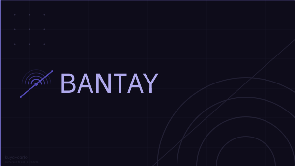

# bantay

> tara na, nandito na ang bantay...

Pre-push git guardian that intercepts secrets before they leave your machine.
Built for the Auth0 "Authorized to Act" Hackathon 2026.

[](https://youtu.be/5gfK5wFCnsE)

## What it does

When you run `git push`, bantay intercepts before anything hits the remote.
Two layers of analysis, one decision, no raw secrets ever leave your machine.

```
git push
  → regex + secretlint scans the diff
  → LLM scores ambiguous findings (masked envelope only)
  → LOW   → push goes through
  → MEDIUM → Auth0 CIBA fires → ntfy notification → you approve on Guardian
  → HIGH  → auto-blocked, no questions asked
```

Fail-closed by design. If anything breaks, the push is blocked.

## Features

- **Two-layer detection** — regex + secretlint for obvious secrets, Vultr/Qwen for context-aware risk scoring on ambiguous findings
- **Auth0 CIBA** — async human-in-the-loop approval via Guardian push notification, not a terminal prompt
- **Metadata envelope** — LLM never sees raw secret values, only masked metadata
- **AES-256-GCM encrypted secrets** — stored locally in `~/.bantay/secrets`
- **ntfy alerts** — out-of-band push notifications to your phone on medium-risk pushes
- **Multi-tenant support** — `bantay login --tenant <name>` for multiple environments
- **Fail-closed** — network failure, LLM timeout, CIBA expiry → push blocked

## Getting started

### Prerequisites

- Node.js 20+
- pnpm

### Install

```bash
pnpm install
pnpm build
```

### Login

```bash
bantay login
```

Walks you through GitHub OAuth, generates an encrypted master key, probes your ntfy instance, and stores everything in `~/.bantay/secrets`. Run once per machine.

### Protect a repo

```bash
bantay init <directory>
```

Installs the pre-push hook. Done.

### Scan manually

```bash
bantay scan              # uncommitted changes (default)
bantay scan --staged     # staged only
bantay scan --pre-push   # used by the hook
bantay scan --all-files  # every tracked file
bantay scan --all        # full history
```

## Configuration

`.bantay.yaml` in your repo root for per-repo policy. Auth credentials are stored encrypted in `~/.bantay/secrets` after `bantay login` — no `.env` file needed.

## Edge cases handled

- **Initial commit** — diffs against null tree, no `HEAD~1` errors
- **No upstream** — falls back gracefully, still scans
- **Network failure** — fail-closed, push blocked
- **Root commit** — `git show -p HEAD` fallback

## Project structure

```
packages/
  core/   → detection engine, LangGraph pipeline, Auth0, ntfy, secrets
  cli/    → commands, git hook installer, terminal output
```

## Test coverage

```
47 tests passing · 94.37% statement coverage
```

## Stack

- TypeScript monorepo — `@bantay/core` + `@bantay/cli`
- LangGraph JS — push → analyze → interrupt → resume graph
- Auth0 CIBA — async human-in-the-loop via Guardian
- @auth0/ai-langchain — Token Vault for GitHub API calls
- secretlint — first-pass detection
- Vultr Serverless Inference — Qwen 2.5 Coder for LLM risk scoring
- ntfy.sh (self-hosted) — out-of-band push notifications
- AES-256-GCM — encrypted local secrets

## Roadmap

### v0.2 — CI integration

- `bantay scan --ci` flag for GitHub Actions
- Block PRs the same way it blocks local pushes
- Status checks on pull requests

### v0.3 — In-house detection engine

- Custom policy rules per org — no secretlint dependency
- `.bantay.yaml` policy DSL for defining what counts as sensitive
- Configurable risk thresholds per branch, per file pattern

### v1.0 — Team visibility

- Dashboard showing what's being flagged across the whole engineering team
- Audit log of all blocked/approved pushes
- Slack/Discord integration alongside ntfy

### v1.1 — Multi-tenant orgs

- Org-level Auth0 tenants
- Role-based approval routing — high risk goes to security lead, not the dev
- SSO support

### maybe v2

- MCP integration — bantay as an MCP server for AI coding agents
- In-editor scanning (VS Code extension)
- PR-level scanning with bot comments

***

Built for the **Auth0 "Authorized to Act" Hackathon 2026**


_tara na, nandito na ang bantay..._
